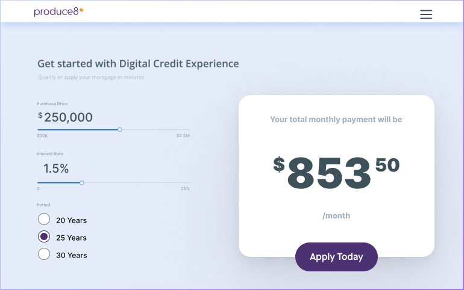
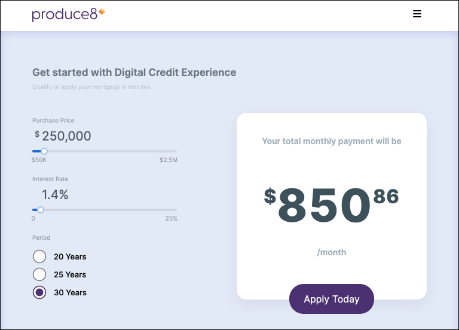

## Purpose

This project was completed as part of the interview process for the front-end developer position at [Produce8](https://www.produce8.com/).

### Project Goals

- Pixel perfect implementation
- Usable in production
- Accessibility
- User experience
- Code reusability and readability
- Learn new technologies

My goal was to simulate a real work environment the best I could. Therefore, I treated this project as if a designer had given me a mockup and had to implement it for real users in production. Based on the screenshot provided, I assumed that the design was for the screen size of 768px wide (i.e. medium screens). Although my implementation is slightly off, I think I came close to the screenshot. It would have been easier if a Figma file had been provided that had specs for each screen size. Nevertheless, the site is fully responsive, and I took it as an opportunity to showcase my design skills.

### Provided screenshot



### My implementation



## Demo

[https://p8-mortgage-calculator.vercel.app/](https://p8-mortgage-calculator.vercel.app/)

## Features

- Users can enter inputs via sliders and radio buttons to calculate a mortgage's monthly payment.
- Users can use a mouse, touch, or keyboard to make selections and adjust values.
  - For keyboard users, the `HOME` and `END` keys can be used.

## Technical Specifications

### Accessibility

Accessibility was mentioned in the project instructions. I immediately thought about using [Reach UI](https://github.com/reach/reach-ui) to fulfill this requirement. Reach UI is exceptionally lightweight, battle-tested, fully accessible, and feels similar to styling a native element.

I used their Slider component as a base to build the custom slider. I also had to build a custom accessible radio group but Reach UI did not have one. So I used one from [React Aria](https://react-spectrum.adobe.com/react-aria/useRadioGroup.html) instead.

I was curious to see how well these libraries performed and surprised to see a 96 accessibility score in Lighthouse benchmarking.

### CSS

My decision to use Styled-Components was because Produce8 themselves uses it in their tech stack. I wanted to emulate as if I was working in their codebase. It was tempting to use what I'm comfortable with (i.e. Tailwind CSS, ChakraUI) to get started quickly, but I decided not to. I reasoned that when working in a team, I wouldn't have the luxury of installing an entire CSS framework or library that is convenient to me.

It was my first time using `styled-components`, so there was a slight learning curve. However, I didn't mind because I always had been interested in this library and thought this project would be an excellent opportunity to use it.

My feedback from this brief experience is positive. I don't think I want to write plain old CSS ever again. If I'm not using Tailwind CSS, `styled-components` would be my preferable choice.

### TypeScript

Like styled-components, this was my first project using TypeScript in the front end. Full disclaimer, I have had some experience with TypeScript on the backend. It's a risky bet to use TypeScript on a coding assessment, but I like challenges. Of course, it helps that I'm currently taking the [Frontend Master's React + TypeScript couse](https://frontendmasters.com/courses/react-typescript/), so there is some familiarity already.

This project was a great way to put my learning to work. Plus, the project starter files were written in TypeScript. I think I did pretty well in managing TypeScript and implementing the solution. I did run into some minor typing issues, such as trying to add types to the Radio Button component. Not a big deal; I figured it out.

### Data Fetching

The data fetching logic was provided by [Kent C. Dodd's](https://kentcdodds.com/) custom [useAsync hook](https://github.com/kentcdodds/advanced-react-hooks/blob/next/src/utils.tsx). It's great for small projects like this one. If I were to write a similar hook that manages data and the different statuses (i.e. loading, pending, etc..), it would be similar to Kent's. His version is battle-tested and is no different from downloading a similar package on a registry. In addition, I would assume there are some data fetching utilities (i.e. Apollo Client, React Query, SWR, Redux + RTK query) in a real production code base.

## User Experience

Since this is a Front-End role I am applying for, I wanted to demonstrate user experience and product-sense skills. Therefore, I considered how I could provide the best user experience when using this mortgage calculator product. Here are some UX details that I implemented:

- Inputs are disabled while calculating(fetching mortgage payment results. This is because we don't want the user adjusting inputs midway through a calculation. Similarly, we don't want a user changing form inputs when submitting a form.
- Keyboard control for selecting precise values.
- Responsive for small, medium and large screens.
- Loading and error states.
- Dynamic font sizing for the monthly payment amount result. When an amount is a large number in the thousands, the `font-size` is decreased and increases for small amounts in the hundreds. This behaviour only applies to small and medium screens because of their limited screen space. We want to prevent text from overflowing and expanding into the inputs section.

## Incomplete

- Radio button selection can be selected outside the radio group
- Radio button loses focuses after keyboard selection
- Replace usage of `any` types
- Tests, tests, tests

---

> ⚠️ The following are instructions provided by Produce8 for this coding assessment

## Getting Started

First, run the development server:

```bash
npm run dev
# or
yarn dev
```

Open [http://localhost:3000](http://localhost:3000) with your browser to see the result.

## My Project Task

Your task can be found here:
[CodeExercise.pdf](https://github.com/Produce8/P8FrontendAssignment/files/7866197/CodeExercise.pdf)

**Project task**

Please build the mockup from the document above in a copy of the repository provided, getting as close as possible to the mockup visually. The repository has an api available already to get the calculated monthly payment based on the inputs, which you should use to get the calculated monthly payment. Feel free to use any component library to help you get started. The font is Inter (https://fonts.google.com/specimen/Inter), and the logo is included in the provided repository.

**Things to think about**

- What happens if the server returns an error?
- What happens while waiting for a response?
- How can this be made accessible?
- How would you display this on a mobile device?
- What kind of tests can you write for this UI?

## The Mortgage API

There is an API route available at /api/mortgageCalculation which will take the following query parameters:

```
principal: [number]
annualInterestRate: [number]
termOfLoan: [number]
```

if you POST to that endpoint, you will receive a monthly payment calculation in response that will look like this:

```
monthlyPayment: [number]
```

If there is an error, the response will look like this:

```
error: [string]
```
